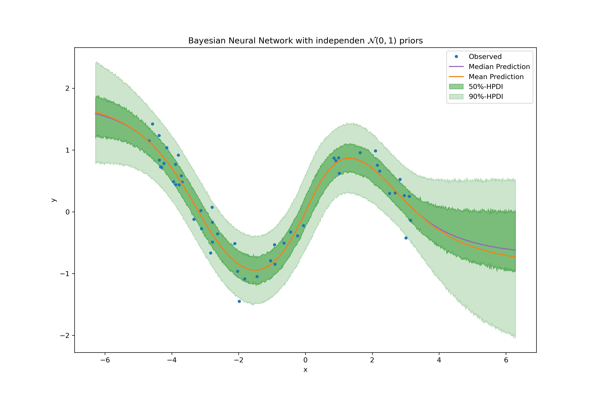
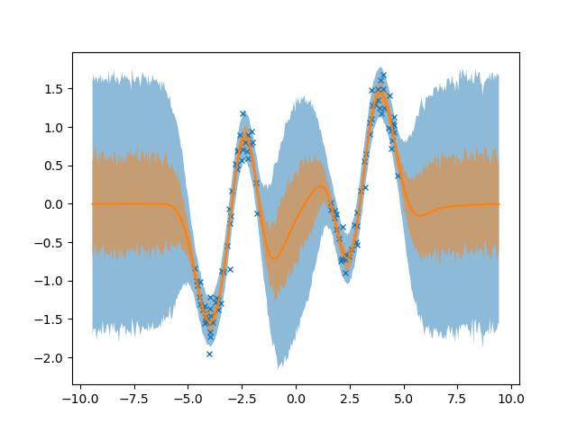
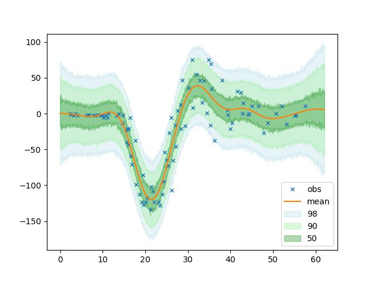

# Bayesian Deep Learning
The intention of this repository is to get a better understanding of Bayesian Deep Learning.
I've choosen to work with [jax](https://github.com/google/jax) and [numpyro](https://github.com/pyro-ppl/numpyro) because they provide the necessary tools (`HMC`, `SVI`, `grad`, `jit`) while, at the same time, they do this without abstractionn as it is the case with Tensorflow or PyTorch. F.e. it is possible to specify a (True) Bayesian Neural Network - HMC/NUTS and not Bayes by Backprob - in only 20 lines of code.

```python
def BayesianDNN(X, y=None):

    N, feature_dim = X.shape
    out_dim = 1, 1
    layer1_dim = 4
    layer2_dim = 4

    # layer 1
    W1 = numpyro.sample(
        "W1",
        dist.Normal(
            loc=jnp.zeros((feature_dim, layer1_dim)),
            scale=jnp.ones((feature_dim, layer1_dim)),
        ),
    )
    b1 = numpyro.sample("b1", dist.Normal(loc=0.0, scale=1.0))
    out1 = nonlin(jnp.matmul(X, W1)) + b1

    # layer 2
    W2 = numpyro.sample(
        "W2",
        dist.Normal(
            loc=jnp.zeros((layer1_dim, layer2_dim)),
            scale=jnp.ones((layer1_dim, layer2_dim)),
        ),
    )
    b2 = numpyro.sample("b2", dist.Normal(loc=0.0, scale=1.0))
    out2 = nonlin(jnp.matmul(out1, W2)) + b2

    # output layer
    W3 = numpyro.sample(
        "out_layer",
        dist.Normal(
            loc=jnp.zeros((layer2_dim, out_dim)), scale=jnp.ones((layer2_dim, out_dim))
        ),
    )
    b3 = numpyro.sample("b3", dist.Normal(loc=0.0, scale=1.0))

    mean = numpyro.deterministic("mean", jnp.matmul(out2, W3) + b3)
    prec_obs = numpyro.sample("prec_obs", dist.Gamma(3.0, 1.0))
    scale = 1.0 / jnp.sqrt(prec_obs)

    numpyro.sample("y", dist.Normal(loc=mean, scale=scale), obs=y)

```






