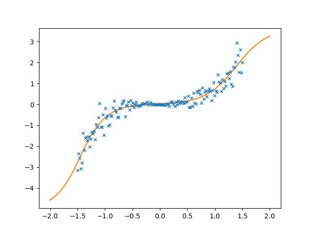
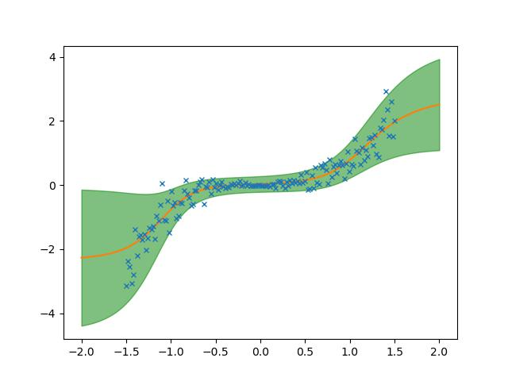
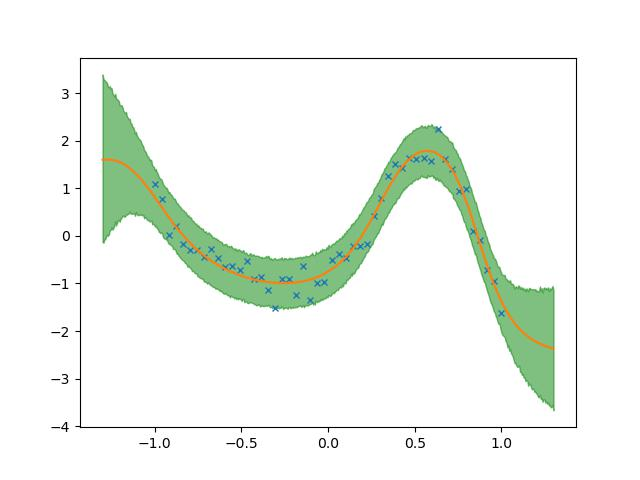

# Bayesian Deep Learning
The intention of this repository is to get a better understanding of Bayesian Deep Learning.
I've choosen to work with [jax](https://github.com/google/jax) and [numpyro](https://github.com/pyro-ppl/numpyro) because they provide the necessary tools (`HMC`, `SVI`, `grad`, `jit`) while, at the same time, they do this without abstractionn as it is the case with Tensorflow or PyTorch. F.e. it is possible to specify a (True) Bayesian Neural Network - HMC/NUTS and not Bayes by Backprob - in only 20 lines of code.

```python
def BNN(X, y=None):

    N, k = X.shape
    D_H1 = 4
    D_H2 = 4

    # layer 1
    W1 = numpyro.sample(
        "W1", dist.Normal(loc=jnp.zeros((k, D_H1)), scale=jnp.ones((k, D_H1)))
    )
    b1 = numpyro.sample("b1", dist.Normal(loc=jnp.zeros(D_H1), scale=1.0))
    out1 = nonlin(jnp.matmul(X, W1)) + b1

    # layer 2
    W2 = numpyro.sample(
        "W2", dist.Normal(loc=jnp.zeros((D_H1, D_H2)), scale=jnp.ones((D_H1, D_H2)))
    )
    b2 = numpyro.sample("b2", dist.Normal(loc=jnp.zeros(D_H2), scale=jnp.ones(D_H2)))
    out2 = nonlin(jnp.matmul(out1, W2)) + b2
    # output layer
    W3 = numpyro.sample(
        "out_layer",
        dist.Normal(loc=jnp.zeros((D_H2, 1)), scale=jnp.ones((D_H2, 1))),
    )
    b3 = numpyro.sample("b3", dist.Normal(loc=jnp.zeros(1), scale=jnp.ones(1)))

    mean = numpyro.deterministic("mean", jnp.matmul(out2, W3) + b3)
    prec_obs = numpyro.sample("prec_obs", dist.Gamma(3.0, 1.0))
    scale = 1.0 / jnp.sqrt(prec_obs)

    with numpyro.plate("data", size=N, dim=-2):
        numpyro.sample("y", dist.Normal(loc=mean, scale=scale), obs=y)

```

## Aleatoric Uncertainty
#TODO add Two linear functions with different noise

Consider f.e. the following plot where the crosses mark our observations and the orange line are out predictions.
Then it is obvious, that our predictions around x=0 will be close to the true observation (we are confident in our prediction) while for predictions outside this region our confidence will decline to to the higher noise in our observations.

This confidence can be captured by our model as depicted in the next plot. Here the shaded area denotes the 90%-confidece interval.

## Epistemic Uncertainty
Uncertainty due to scarce data




